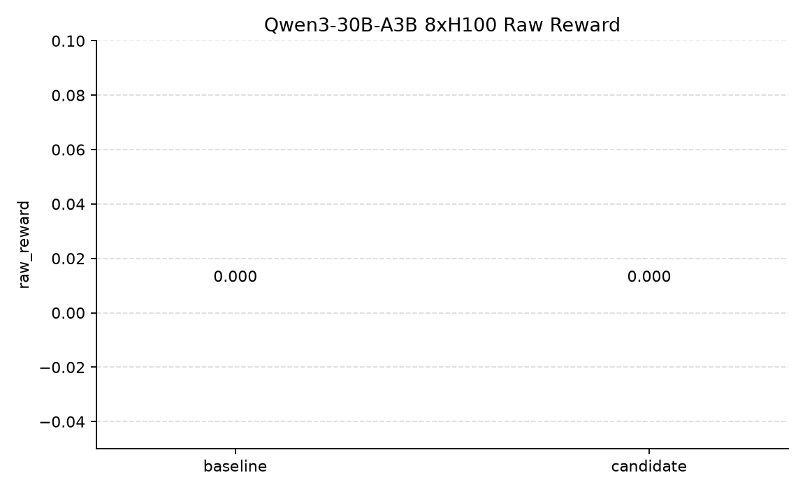
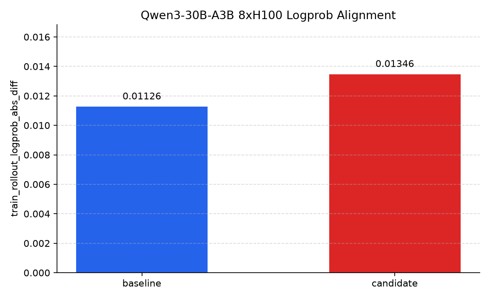
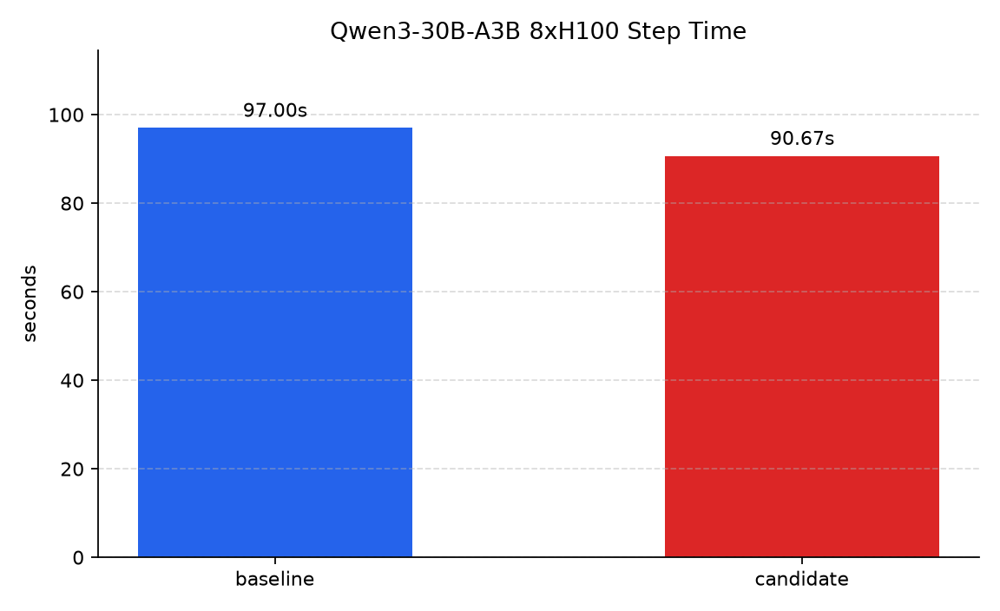
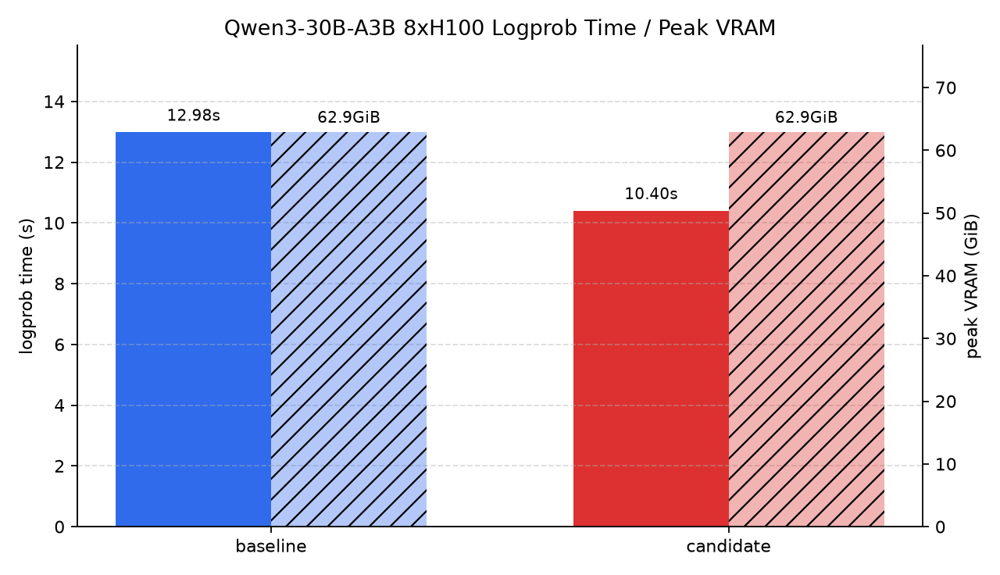
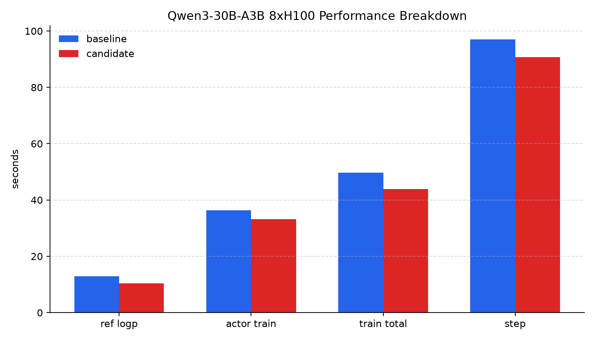

# RL-Kernel linear_logp Qwen3-30B-A3B 8xH100 实验记录

更新时间: 2026-06-27 11:35 UTC

## 结论摘要

本轮只记录成功完成的 TP=8 smoke validation，不记录失败 run。baseline 使用 benchmark-only vime，candidate 使用当前 PR 分支并只启用 `RL-Kernel linear_logp`。

在相同 Qwen3-30B-A3B、8xH100、TP=8/EP=8/CP=1、单 prompt/单 sample/单 step smoke 配置下：

| 项目 | baseline | candidate | 变化 |
| --- | ---: | ---: | ---: |
| raw_reward | 0.000000 | 0.000000 | 持平 |
| rollout_log_probs | -0.181073 | -0.181073 | 持平 |
| ref_log_probs | -0.182800 | -0.182881 | 差异 -0.000081 |
| train_rollout_logprob_abs_diff | 0.011258 | 0.013460 | +0.002202 |
| ref_log_probs_time | 12.980901 s | 10.400161 s | -19.88% |
| actor_train_time | 36.332478 s | 33.124115 s | -8.83% |
| train_time | 49.632797 s | 43.838564 s | -11.67% |
| step_time | 96.997870 s | 90.671674 s | -6.52% |
| actor_train_tok_per_s | 9.000212 | 9.871962 | +9.69% |
| peak_vram | 64363 MiB | 64363 MiB | 持平 |
| RL-Kernel fallback count | N/A | 0 | 命中主路径 |

当前数据能证明：TP=8 下 `linear_logp` 集成可成功跑通，candidate 命中 SM90 fused backend 且没有 fallback；selected-logprob/ref-logprob 路径耗时下降，训练/rollout logprob alignment 仍在同一量级。该结果是 smoke validation，不替代 `vime-RLK.md` 中要求的多 run、多 step 正式宣传 benchmark。

## 图表











结构化指标同时保存为 [data/metrics.csv](data/metrics.csv)。

## 实验范围

| 项目 | 设置 |
| --- | --- |
| baseline | `/workspace/vime-benchmark`，RL-Kernel off |
| candidate | `/workspace/vime-rlk-integration`，PR 分支 `vime-rlk-integration` |
| enabled RL-Kernel ops | `linear_logp` only |
| 模型 | `/root/Qwen3-30B-A3B` |
| Megatron checkpoint | `/root/Qwen3-30B-A3B_torch_dist` |
| 训练数据 | `/root/dapo-math-17k/dapo-math-17k.jsonl` |
| Eval 数据 | `/root/aime-2024/aime-2024.jsonl` |
| GPU | 8 x NVIDIA H100 80GB HBM3 |
| CUDA_HOME | `/usr/local/lib/python3.11/dist-packages/nvidia/cu13` |
| Python | 3.11.10 |
| Torch | 2.11.0+cu130 |
| vLLM | 0.22.0 |

后续所有 `linear_logp` 实验均以 `TP=8` 为准。`scripts/run-qwen3-30B-A3B.sh` 和 `vime-RLK.md` 中默认 TP 已同步为 8。

## Run 配置

| 配置 | baseline | candidate |
| --- | --- | --- |
| run_name | `smoke-baseline-tp8` | `smoke-candidate-tp8` |
| Ray job | `raysubmit_rUd8WjeLXv4eZxcb` | `raysubmit_rbz7TUKU3T7U4GPm` |
| 状态 | succeeded | succeeded |
| TP / EP / CP | 8 / 8 / 1 | 8 / 8 / 1 |
| rollout engines | 1 engine, 8 GPU per engine | 1 engine, 8 GPU per engine |
| NUM_ROLLOUT | 1 | 1 |
| ROLLOUT_BATCH_SIZE | 1 | 1 |
| N_SAMPLES_PER_PROMPT | 1 | 1 |
| GLOBAL_BATCH_SIZE | 1 | 1 |
| ROLLOUT_MAX_RESPONSE_LEN | 128 | 128 |
| MAX_TOKENS_PER_GPU | 4096 | 4096 |
| VLLM_GPU_MEMORY_UTILIZATION | 0.7 | 0.7 |
| VIME_VLLM_ENFORCE_EAGER | 1 | 1 |
| VIME_NO_GRAD_ACCUM_FUSION | 1 | 1 |
| VIME_SKIP_EVAL_BEFORE_TRAIN | 1 | 1 |
| VIME_RL_KERNEL | 0 | 1 |
| VIME_RL_KERNEL_OPS | empty | `linear_logp` |
| VIME_RL_KERNEL_STRICT | 0 | 1 |

本地原始日志目录位于 `experiments/rlk-linear-logp-qwen3-30b-a3b-8h100/runs/`，该目录被 `.gitignore` 屏蔽，不随 PR 提交。报告和图表使用日志中抽取出的成功指标；原始 checkpoint 在指标抽取后已清理。

## Candidate backend 命中情况

candidate 日志确认：

```text
Using RL-Kernel linear_logp op: FusedLinearLogpSM90Op
Successfully linked to precompiled _C.fused_linear_logp_sm90 kernel
train/rl_kernel_fallback_count: 0.0
Job 'raysubmit_rbz7TUKU3T7U4GPm' succeeded
```

这说明本次 candidate 走的是 RL-Kernel `linear_logp` fused backend，没有落回 vime materialized logits 路径。

## 关键修复

### TP 统一为 8

`linear_logp` 后续实验统一按 `TP=8` 执行。脚本默认值和实验文档中的命令均已改为：

```text
MEGATRON_TP=8
MEGATRON_EP=8
MEGATRON_CP=1
```

### CUDA 13 torch_memory_saver preload

当前环境安装的是 CUDA 13 版本 preload so：

```text
torch_memory_saver_hook_mode_preload_cu13.abi3.so
```

原代码只查 CUDA 12 或通用 preload so，会导致 Megatron actor 初始化阶段找不到 preload 库。已在 `vime/ray/actor_group.py` 增加 CUDA 13 preload 文件名支持。

### gradient accumulation fusion

TP=8 smoke 在当前 Torch/CUDA 13/Apex 组合下，Megatron fused gradient accumulation 可能触发 cuBLAS 初始化错误。实验脚本加入：

```text
VIME_NO_GRAD_ACCUM_FUSION=1
--no-gradient-accumulation-fusion
```

该配置下 baseline 和 candidate 均成功完成。

### 禁用实验 checkpoint 保存

30B checkpoint 很大，本次 smoke 初始运行每个 run 会产生约 400GB checkpoint。为避免后续复现实验继续写入大文件，`scripts/run-qwen3-30B-A3B.sh` 新增：

```text
VIME_DISABLE_SAVE=1
```

该开关启用时不传 `--save` 和 `--save-interval`，`save_interval=None` 会关闭训练循环中的周期保存。实验 runner `run_one.sh` 默认设置 `VIME_DISABLE_SAVE=1`。

### untied LM Head 权重

Qwen3 使用 untied embedding/output weights。`linear_logp` 的数学路径是：

```text
logp = log_softmax(hidden_states @ output_layer.weight.T + bias)[target_token]
```

因此 `linear_logp` 需要 LM Head 权重，但没有额外启用独立的 RL-Kernel LM Head op。修复前在 PP=1 且 `pre_process=True` 的模型上，辅助函数可能优先拿到 `shared_embedding_or_output_weight()` 返回的 embedding weight，而不是 untied `output_layer.weight`，这会造成 train/ref/rollout logprob 不一致。

已修复为优先使用 `output_layer.weight`，仅在该权重不可用时才回退到 shared embedding/output weight。新增单测覆盖：

```text
test_linear_logp_context_prefers_output_layer_weight_for_untied_pp1_model
test_linear_logp_context_uses_shared_weight_when_output_layer_weight_is_missing
```

## 指标明细

| 指标 | baseline | candidate |
| --- | ---: | ---: |
| rollout/raw_reward | 0.000000 | 0.000000 |
| rollout/rewards | 0.000000 | 0.000000 |
| rollout/response_lengths | 128.000000 | 128.000000 |
| rollout/truncated | 1.000000 | 1.000000 |
| rollout/rollout_log_probs | -0.181073 | -0.181073 |
| rollout/ref_log_probs | -0.182800 | -0.182881 |
| rollout/kl | 0.000000 | 0.000000 |
| train/loss | 0.000000 | 0.000000 |
| train/entropy_loss | 0.153894 | 0.000000 |
| train/train_rollout_logprob_abs_diff | 0.011258 | 0.013460 |
| train/grad_norm | 0.000000 | 0.000000 |
| train/rl_kernel_fallback_count | N/A | 0.000000 |
| perf/rollout_time | 7.401981 s | 7.559618 s |
| perf/ref_log_probs_time | 12.980901 s | 10.400161 s |
| perf/actor_train_time | 36.332478 s | 33.124115 s |
| perf/train_time | 49.632797 s | 43.838564 s |
| perf/update_weights_time | 35.229457 s | 35.257555 s |
| perf/step_time | 96.997870 s | 90.671674 s |
| perf/actor_train_tok_per_s | 9.000212 | 9.871962 |
| peak_vram | 64363 MiB | 64363 MiB |

`train/entropy_loss` 在 candidate 中为 0 是预期行为：当前 `entropy_coef=0` 且 `linear_logp` context 激活时，policy loss 路径不再为指标额外 materialize logits 计算 entropy，避免抵消 `linear_logp` 的收益。该值不用于本轮质量对齐判断。

## 验证记录

已执行：

```bash
pytest tests/test_rl_kernel_args.py tests/test_rl_kernel_linear_logp_integration.py tests/test_value_temperature.py tests/test_metric_report.py -q
```

结果：

```text
41 passed, 15 warnings in 5.51s
```

已执行：

```bash
pytest tests/test_rl_kernel_logp_integration.py tests/test_rl_kernel_args.py tests/test_rl_kernel_linear_logp_integration.py -q
```

结果：

```text
26 passed, 15 warnings in 5.28s
```

已执行：

```bash
bash -n scripts/run-qwen3-30B-A3B.sh
bash -n experiments/rlk-linear-logp-qwen3-30b-a3b-8h100/run_one.sh
git diff --check
```

结果：均通过。

图表文件已用 PIL 检查尺寸和像素方差，均为非空 PNG。

## 复现实验

本实验目录提供统一入口：

```bash
cd /workspace/vime-rlk-integration

CUDA_VISIBLE_DEVICES=0,1,2,3,4,5,6,7 \
NUM_GPUS=8 \
MEGATRON_TP=8 \
MEGATRON_EP=8 \
MEGATRON_CP=1 \
ROLLOUT_NUM_GPUS_PER_ENGINE=8 \
ROLLOUT_BATCH_SIZE=1 \
N_SAMPLES_PER_PROMPT=1 \
GLOBAL_BATCH_SIZE=1 \
MAX_TOKENS_PER_GPU=4096 \
ROLLOUT_MAX_RESPONSE_LEN=128 \
NUM_ROLLOUT=1 \
VLLM_GPU_MEMORY_UTILIZATION=0.7 \
VIME_DISABLE_SAVE=1 \
experiments/rlk-linear-logp-qwen3-30b-a3b-8h100/run_one.sh \
  candidate \
  smoke-candidate-tp8 \
  /workspace/vime-rlk-integration \
  /workspace/vime-rlk-integration/experiments/rlk-linear-logp-qwen3-30b-a3b-8h100/runs/smoke-candidate-tp8
```

baseline 将第一个参数改为 `baseline`，repo 改为 `/workspace/vime-benchmark`，并使用不同 run 目录即可。

## 后续正式 benchmark 建议

当前 smoke validation 已满足接入正确性、backend 命中、无 fallback、TP=8 跑通和单 step 性能趋势确认。若要作为主宣传数字，仍应按 `vime-RLK.md` 做更长 run：

| 项目 | 建议 |
| --- | --- |
| run 次数 | baseline/candidate 每组至少 3 次 |
| step 数 | 丢弃前 5-10 step warmup 后统计 |
| 统计项 | mean/p50/p90 step time、logprob time、peak VRAM、reward、logprob alignment |
| 口径 | 保持 TP=8/EP=8/CP=1，candidate 仅启用 `linear_logp` |
